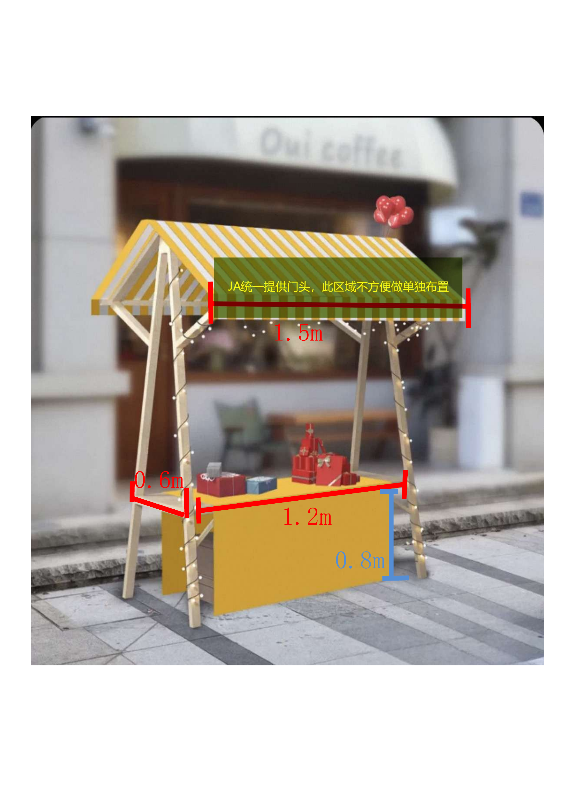
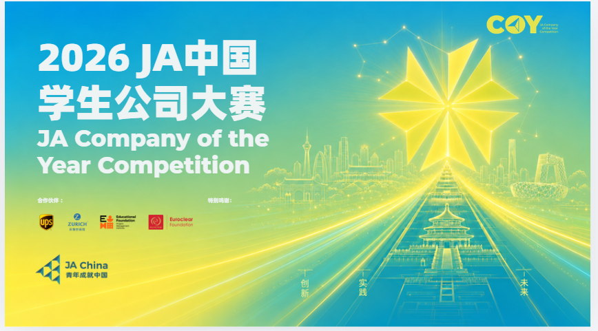

# 2026COY会议微站（资料汇总）

# 首页

**2026JA中国学生公司全国赛**

**青年成就中国 · 见证未来商业领袖的实践与成长**

- **硬核青年 \| 3分钟读懂COY**
**走进“JA学生公司”：**在这里，高中生不只是学习创业，更是在真实商业实践中探索未来。3分钟，带你了解他们的成就之路——把梦想变成行动，而在困难面前坚持前行的勇气，才是他们成长的“隐形奖杯”。

- **璀璨星光 \| 全阵容集结**
**优秀团队：**本届全国大赛汇聚了在这一学年里"边学习、边创业"并脱颖而出的优秀学生团队，更有来自企业界与教育界的嘉宾齐聚现场，以专业视角为青年的创业实践赋能，共同见证青少年的探索、突破与成就之路。

- **参赛必看 \| 一站式服务**
**赛事指南：**拒绝迷路！比赛期间所需的日程安排、场馆交通、注意事项等重要信息已为您全量整合。一键查阅，助你轻装上阵，全神贯注迎接挑战！

### 一、走进“JA学生公司” 

- **关于JA**

    JA（Junior Achievement，青年成就）是全球最大的致力于青少年职业发展、财务素养和创业教育的非营利教育组织之一。 JA中国成立于1993年。三十多年来，我们始终坚持"以学生为中心"的教育理念：
    **跨界链接**：深度链接企业与学校。
    **志愿精神**：将企业的社会责任与员工的志愿者精神，转化为系统化支持学生项目化学习的实践课程。
    **育人使命**：激励和培养中国青少年以品格和能力在全球经济中成功。

    **32年****：**深耕中国实践教育

    **74个城市****：**覆盖全国核心城市

    **800万\+：**累积惠及青少年

- **一分钟看懂"JA学生公司"**

    **这不仅是一门课程，更是一场真实的商业实战。**

    2025\-2026学年，《JA学生公司》项目在北京、上海、成都、西安、长沙等近50所学校开展。 在长达一学年的时间里，中学生们在学校老师与企业志愿者导师的指导和陪伴下，组建2\-6人的创始团队，成立并运营一家真实的"学生公司"。他们需要直面真实的市场竞争，自负盈亏。**最重要的是，项目一路上所有的核心商业决策，均由学生独立自主完成。**

- **学生的足迹：**加入学生公司项目 $\rightarrow$ 运营实践 $\rightarrow$ 清算结业 $\rightarrow$ 地区赛 $\rightarrow$ 全国大赛 $\rightarrow$ 亚太大赛

    致敬参赛同学： “回顾这一年，你们跨越了修改方案的深夜，直面了团队的分歧。今天，你们终于站到了全国赛（COY）的舞台！无论结果如何，你们都已经在这条硬核的创业路上留下了青春的正反馈！”

### 二、璀璨星光阵容

**20强参赛团队**

- **文案引导：** *“我们是XX学生公司，正在角逐2026COY，一起来见证我们的学习成果，快来点赞吧！”* 

**嘉宾/评委阵容：**

**刘佳岩**

星竞威武集团 企业社会责任总监

**王昱东**

北京国际设计周有限公司 董事长

**郝庭帅**

天津世纪集团有限公司 总经理

**李佳璐**

北京发那科  品牌管理与推广部部长行政与后勤保障部部长

**赵雪峰**

中共邢台市驻京流动党委 驻京流动党委副书记

**徐文阁**

河北威县驻京流动党员党委 书记

**蔡广明**

UPS 销售培训经理

**王云彬**

JA China Executive Director 

**黄皞**

森隆集团 总裁

**徐雯**

香港德林控股集团 合伙人

### 三、赛事指南

- **大赛日程：**

    **7月23日（星期四）· 大赛启航**

    09:00 \- 09:50 \| 开幕式

    09:50 \- 11:05 \| 破冰活动

    11:05 \- 11:30 \| 师生说明会

    13:00 \- 17:30 \| Titan工作坊

    **7月24日（星期五）· 创意市集**** （对外开放）**

    亚运村新辰里购物中心B1层

    10:00 \- 14:00 \| 学生市集 · 挂牌营业 

    **7月25日（星期六）· 巅峰决战**** **

    09:30 \- 09:40 \| 开场致辞

    09:40 \- 12:00 \| 学生商业路演（对外开放）北辰五洲皇冠国际酒店 第一会议室

    13:30 \- 15:40 \| 评委面试与反馈（不对外开放）北辰五洲皇冠国际酒店 第八会议室、第九会议室

    18:30 \- 21:30 \| 颁奖晚宴（不对外开放）

**参赛手册 \& 常见问题：** 

**市集展销**

**必读：详细规则与硬性要求**

- **组委会提供：** 为每队分配 1 个标准展位。

- **库存与包装：** 提前备足产品库存，确保产品包装完整、安全、规范。

- 所有布置材料（含剪刀、胶带、绳子、夹子、展板、海报、产品等）须由团队自行准备并运送至现场。

- **展位布置：** 必须包含公司及产品介绍、产品展示区、装饰元素、销售专区。

- **撤展规范：** 市集结束后，各团队必须负责彻底清理，带走所有自有物资及垃圾。

- **摊位尺寸参考图**

    - 门头宽度（JA统一提供）：**1\.5m**

    - 桌面宽度：**1\.2m**

    - 桌面深度：**0\.6m**

    - 桌下空间高度：**0\.8m**

- **门头区域由JA统一布置，不建议单独装饰**

- **物料绝对自理：所有布置材料（含剪刀、胶带、绳子、夹子、展板、海报、产品等）须由团队自行准备并运送至现场。**

**路演展示**

**必读：详细规则与硬性要求**

- **人数与时间：** 展示顺序赛前抽签决定。每队上台不超过**4人**。展示时间**绝对限制在5分钟内**（最后1分钟有提示，超时将被主持人强行终止）。

- **设备与操作：** 必须使用组委会提供的电脑（**不接受自带电脑**，提供翻页笔）。电脑操作需由团队成员自行完成。如遇参赛团队自身技术或操作引发的延迟，计入展示时间，无重复展示机会。

- **强制彩排测试：7月22日 14:00\-17:00 组委会统一安排设备测试（每队5分钟），重点测试麦克风、站位、PPT翻页及视频播放。每家必须派 1 名代表参加。现场绝不接受更换或修改PPT。错过指定时间无法补测。**

**评委面试**

**必读：详细规则与硬性要求**

- 每支团队接受**8分钟**单独面试，**必须全员参与**。

- 面试分2个房间同时进行（每间10支团队），**面试顺序与路演展示顺序一致**。

- 所有团队面试结束后，评委将为面试的10支团队提供统一反馈，带队老师可一起旁听。

- **北京探索指南：**

    - *后勤保障：*

    - 商场：新辰里商场，距离酒店步行3分钟

    - 打印店：

        - 一丰24小时自助打印，距离酒店步行10分钟

        - 水利达图文快印（北辰汇园酒店公寓R座店），距离酒店步行8分钟

    - *城市探索：* 推荐比赛期间可前往的城市地标，例如：

        - 奥林匹克森林公园 

        - 国家体育场（鸟巢） 

        - 国家游泳中心（水立方） 

        - 中国共产党历史展览馆（如时间允许） 

        - 国家科技馆（适合学生参观）

        - 中国工艺美术馆 

### 赛事直播

2026 COY 全国大赛 · 直播入口

**照片直播 · 实时精彩瞬间（7月23日\-7月25日）**

扫描二维码或点击链接，查看赛事现场高清即时照片

https://live\.photoplus\.cn/live/pc/16282770/\#/live

**视频直播 · 创业路演直播（7月24日 09:30）**

扫描二维码或点击链接，观看创业实践路演直播

### 四、加入我们 \| 家校社企协同 共同托举未来

- **JAer学生回归：**

    曾经参与JA项目的你，欢迎回到JA大家庭！连接跨界伙伴，以“企业志愿者导师”的身份重返课堂，分享真实商业经历与成长故事，让成长经验继续传递。

    青春未完待续 JAer登记：https://jforms\.jachina\.org/f/o52Ukr

- **志愿者招募：**

    成为学生公司项目企业导师、赛事评委或现场志愿者，参与课堂实践与赛事支持。分享你的专业经验，激发学生探索商业世界的热情，并获得JA官方认证的志愿服务荣誉。

    用专业赋能未来 立即申请：https://community\.jachina\.org/\#home

- **企业合作入口：**

    携手JA中国，将企业资源与CSR实践相结合。通过项目年度赞助、员工志愿服务、企业开放日等多元合作方式，将商业智慧转化为青年成长力量，共同投资下一代的发展。

    共创CSR影响力 申请合作：https://jachina\.feishu\.cn/share/base/form/shrcnA6Piro6Wc7HLEPJ3hFGt2c?prefill\_Source=wechat\_JaChina\_002\&hide\_Source=1

- **学校项目申请：**

    期待将创业实践、生涯规划、金融素养与可持续发展等公益教育项目，引入综合实践课堂吗？JA中国提供系统化课程支持、企业导师进课堂以及全国赛展示交流机会，助力学生在实践中发现潜能。

    让教育连接真实世界 提交申请：https://jachina\.feishu\.cn/share/base/form/shrcnkGkx9bRWZtNzFueaPFbDVb?prefill\_Source=wechat\_JaChina\_002\&hide\_Source=1

    

# 更新方式（网站UI）参考

